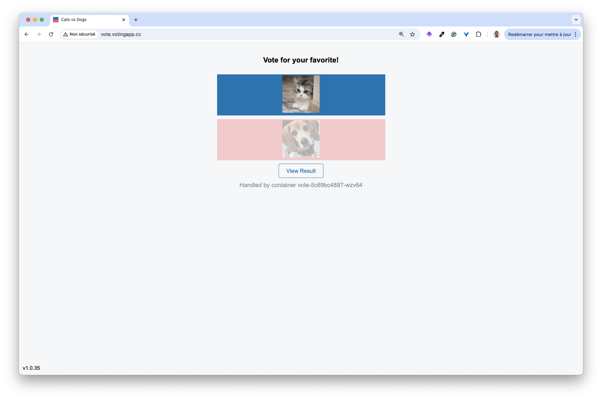
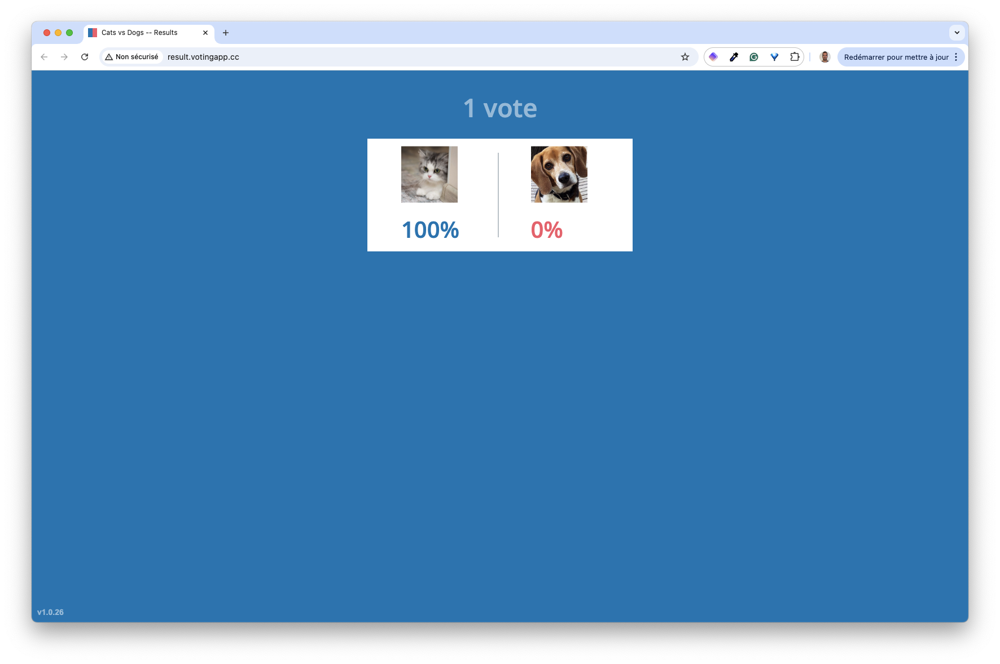

## Purpose

This plugin allows ArgoCD to manage applications defined using Helmfile

## Prerequisite

In order to test this plugin you need a Kubernetes cluster (it can even be a local k3s cluster running on a multipass VM). Also, make sure you have:
- Helm ([https://github.com/helm/helm/releases](https://github.com/helm/helm/releases))
- helm-diff plugin ([https://github.com/databus23/helm-diff](https://github.com/databus23/helm-diff))
- Helmfile ([https://github.com/helmfile/helmfile#installation](https://github.com/helmfile/helmfile#installation))

Ex: installation on Linux / amd64
```
OS=linux     # change to match your current os (linux / darwin)
ARCH=amd64   # change to match your current architecture (amd64 / arm64)

# Helm
curl -sSLO https://get.helm.sh/helm-v3.10.2-$OS-$ARCH.tar.gz
tar zxvf helm-v3.10.2-$OS-$ARCH.tar.gz
sudo mv ./$OS-$ARCH/helm /usr/local/bin

# Helm-diff
helm plugin install https://github.com/databus23/helm-diff

# Helmfile
curl -sSLO https://github.com/helmfile/helmfile/releases/download/v0.148.1/helmfile_0.148.1_$OS_$ARCH.tar.gz
tar zxvf helmfile_0.148.1_$OS_$ARCH.tar.gz
sudo mv ./hemlfile /usr/local/bin/
```

## Installation of ArgoCD + the helmfile plugin

There are currently 2 installation options in this repo:
- a quick path to install ArgoCD and its Helmfile plugin in 2 commands
- a detailed path to understand the installation steps

### Quick path

Use the following command (make sure you have the prerequisites first) which creates a Helmfile defining ArgoCD + the helmfile plugin:

```
cat <<EOF > helmfile.yaml
repositories:
  - name: argo
    url: https://argoproj.github.io/argo-helm

releases:
  - name: argo
    namespace: argo
    labels:
      app: argo
    chart: argo/argo-cd
    version: ~5.14.1
    values:
    - repoServer:
        extraContainers:
        - name: plugin
          image: lucj/argocd-plugin-helmfile:v0.0.10
          command: ["/var/run/argocd/argocd-cmp-server"]
          securityContext:
            runAsNonRoot: true
            runAsUser: 999
          volumeMounts:
          - mountPath: /var/run/argocd
            name: var-files
          - mountPath: /home/argocd/cmp-server/plugins
            name: plugins
EOF
```

and deploy it into the cluster:

```
helmfile apply
```

Note: this quick path does not take into account the usage of a private key to encrypt sensitive properties in the values files. If you want to use such an encryption key please read the detailed path below.

That's it, you can now go directly into the *Usage* step.

### Detailed path

If you want to understand a little bit more what is happening under the hood, you can follow the following instructions to install and configure ArgoCD + the Helmfile plugin.

The following installs ArgoCD using the helm chart available on [https://artifacthub.io/packages/helm/argo/argo-cd](https://artifacthub.io/packages/helm/argo/argo-cd)

- First option:

Using the following helm commands:

```
helm repo add argo https://argoproj.github.io/argo-helm

helm upgrade --install --create-namespace -n argo argo-cd argo/argo-cd --version 5.14.1
```

- Second option:

Create the following helmfile.yaml:

```
repositories:
  - name: argo
    url: https://argoproj.github.io/argo-helm

releases:
  - name: argo
    namespace: argo
    labels:
      app: argo
    chart: argo/argo-cd
    version: ~5.14.1
```

then run the following command:

```
helmfile apply
```

Once ArgoCD is installed, we need to enable the Helmfile plugin. The binaries needed for the plugin are currently packaged into the following image in the DockerHub: [https://hub.docker.com/r/lucj/argocd-plugin-helmfile/tags](https://hub.docker.com/r/lucj/argocd-plugin-helmfile/tags)

Follow the steps below to make sure ArgoCD can use this plugin:

- creation of a age.key

This steps allows an admin to encrypt yaml files containing sensitive values and commit them into git. ArgoCD will use this key to decrypt the secrets before it can install/update an application.

First make sure you have age installed ([https://github.com/FiloSottile/age](https://github.com/FiloSottile/age)), then create a key:  

```
age-keygen > key.txt
```

- create a secret from this key

```
kubectl -n argo create secret generic age --from-file=./key.txt
```

- in the values.yaml file of ArgoCD helm chart, define an additional volume (containing this new secret) in the repo-server pod

```
repoServer:
  volumes:
    - name: age
      secret:
        secretName: age
```

- still in the values.yaml file, define an extraContainer (sidecar container containing the plugin) and give it access to the age key

```
repoServer:
  volumes:
    - name: age
      secret:
        secretName: age

  extraContainers:
  - name: plugin
    image: lucj/argocd-plugin-helmfile:v0.0.10
    command: ["/var/run/argocd/argocd-cmp-server"]
    securityContext:
      runAsNonRoot: true
      runAsUser: 999
    env:
    - name: SOPS_AGE_KEY_FILE
      value: /app/config/age/key.txt
    volumeMounts:
    - name: age
      mountPath: "/app/config/age/"
```

- also mount into this container the following volumes (plugins + var-files)

```
repoServer:
  volumes:
    - name: age
      secret:
        secretName: age

  extraContainers:
  - name: plugin
    image: lucj/argocd-plugin-helmfile:v0.0.10
    command: ["/var/run/argocd/argocd-cmp-server"]
    securityContext:
      runAsNonRoot: true
      runAsUser: 999
    env:
    - name: SOPS_AGE_KEY_FILE
      value: /app/config/age/key.txt
    volumeMounts:
    - name: age
      mountPath: "/app/config/age/"
    - mountPath: /var/run/argocd
      name: var-files
    - mountPath: /home/argocd/cmp-server/plugins
      name: plugins
```

- update ArgoCD so it takes into account the new values and then the new helmfile plugin

The update can be done using the following command (if ArgoCD was installed directly with helm):

```
helm upgrade --install --create-namespace -n argo argo-cd argo/argo-cd --version 5.12.3 -f values.yaml
```

Or with this command (if ArgoCD was installed with Helmfile):

```
helmfile apply
```

## Usage

Create the following ArgoCD Application resource which defines the VotingApp, a sample microservice application. ArgoCD will automatically deploy this application using the helmfile plugin.

```
cat <<EOF | kubectl apply -f -
apiVersion: argoproj.io/v1alpha1
kind: Application
metadata:
  name: votingapp
  namespace: argo
  finalizers:
    - resources-finalizer.argocd.argoproj.io
spec:
  project: default
  source:
    repoURL: https://gitlab.com/voting-application/config.git
    targetRevision: master
    path: helm
    plugin: {}
  destination:
    server: https://kubernetes.default.svc
    namespace: vote
  syncPolicy:
    automated: {}
    syncOptions:
      - CreateNamespace=true
EOF
```

ArgoCD web interface show the app deployed and in sync


You will then be able to vote for your favorite pet and see the result:
- the vote UI is exposed as a NodePort service (available on port 31000)
- the result UI is exposed as a NodePort service (available on port 31001)





## Status

This is currently a work in progress. Feel free to give it a try and provide feedback :)

## License

MIT License

Copyright (c) [2022]

Permission is hereby granted, free of charge, to any person obtaining a copy
of this software and associated documentation files (the "Software"), to deal
in the Software without restriction, including without limitation the rights
to use, copy, modify, merge, publish, distribute, sublicense, and/or sell
copies of the Software, and to permit persons to whom the Software is
furnished to do so, subject to the following conditions:

The above copyright notice and this permission notice shall be included in all
copies or substantial portions of the Software.

THE SOFTWARE IS PROVIDED "AS IS", WITHOUT WARRANTY OF ANY KIND, EXPRESS OR
IMPLIED, INCLUDING BUT NOT LIMITED TO THE WARRANTIES OF MERCHANTABILITY,
FITNESS FOR A PARTICULAR PURPOSE AND NONINFRINGEMENT. IN NO EVENT SHALL THE
AUTHORS OR COPYRIGHT HOLDERS BE LIABLE FOR ANY CLAIM, DAMAGES OR OTHER
LIABILITY, WHETHER IN AN ACTION OF CONTRACT, TORT OR OTHERWISE, ARISING FROM,
OUT OF OR IN CONNECTION WITH THE SOFTWARE OR THE USE OR OTHER DEALINGS IN THE
SOFTWARE.

